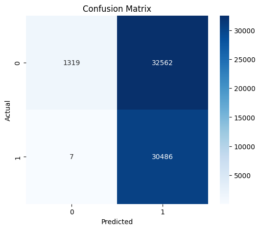
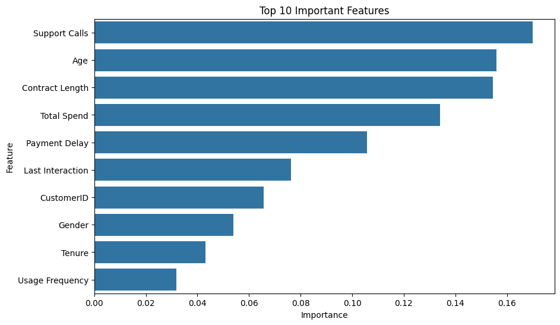

# Customer Churn Prediction - Model Optimization

## Name
**Athulyakrishna K**

## MUID
**athulyakrishnak@mulearn**

---

# Customer Churn Prediction using Machine Learning

## Dataset Overview

This project focuses on predicting customer churn using Machine Learning. A baseline Random Forest classifier was built and then optimized using GridSearchCV to improve its performance. The objective is to identify customers who are likely to churn and determine the factors that influence churn.

**Dataset:** Customer Churn Dataset

---

# Technologies Used

- Python
- Google Colab
- Pandas
- NumPy
- Matplotlib
- Seaborn
- Scikit-learn

---

# Project Workflow

1. Data Loading
2. Data Cleaning
3. Exploratory Data Analysis (EDA)
4. Label Encoding
5. Baseline Random Forest Model
6. Model Optimization using GridSearchCV
7. Model Evaluation
8. Confusion Matrix
9. Feature Importance Analysis
10. Recommendations

---

# Baseline Model Performance

| Metric | Value |
|---------|-------|
| Accuracy | **29.90%** |
| Precision | **27.05%** |
| Recall | **99.91%** |
| F1 Score | **42.57%** |

---

# Optimized Model Performance

| Metric | Value |
|---------|-------|
| Accuracy | **49.41%** |
| Precision | **48.35%** |
| Recall | **99.98%** |
| F1 Score | **65.18%** |

---

# Model Improvement

| Metric | Baseline | Optimized |
|---------|----------|-----------|
| Accuracy | 29.90% | **49.41%** |
| Precision | 27.05% | **48.35%** |
| Recall | 99.91% | **99.98%** |
| F1 Score | 42.57% | **65.18%** |

The optimized Random Forest model showed noticeable improvements in Accuracy, Precision, and F1 Score while maintaining an excellent Recall.

---

# Confusion Matrix



**Observation**

- The optimized model correctly classified most churn cases.
- Recall remained very high after optimization.
- Some non-churn customers were still incorrectly predicted as churn.

---

# Feature Importance



### Top Features Influencing Customer Churn

1. Support Calls
2. Age
3. Contract Length
4. Total Spend
5. Payment Delay
6. Last Interaction
7. CustomerID
8. Gender
9. Tenure
10. Usage Frequency

---

# Key Findings

- Customers with a higher number of support calls are more likely to churn.
- Contract length significantly affects customer retention.
- Payment delays increase the likelihood of churn.
- Customer age influences churn behavior.
- Customers with lower spending tend to have a higher churn risk.

---

# Optimization Approach

The baseline Random Forest model was optimized using **GridSearchCV**.

### Best Hyperparameters

```python
{
    'max_depth': None,
    'min_samples_leaf': 2,
    'min_samples_split': 2,
    'n_estimators': 200
}
```

GridSearchCV selected the best combination of hyperparameters using 5-fold cross-validation.

---

# Recommendations

- Improve customer support to reduce repeated support calls.
- Encourage customers to select longer contract plans.
- Monitor customers with frequent payment delays.
- Introduce loyalty programs for high-risk customers.
- Improve customer engagement through regular follow-ups.

---

# Conclusion

This project successfully developed a customer churn prediction model using the Random Forest algorithm. Model performance was improved through hyperparameter tuning with GridSearchCV. The optimized model achieved better Accuracy, Precision, and F1 Score compared to the baseline model while maintaining a very high Recall.

Feature importance analysis revealed that **Support Calls, Age, Contract Length, Total Spend, and Payment Delay** are the most influential factors affecting customer churn. These insights can help organizations identify at-risk customers and implement targeted retention strategies.

```
* Python
* Pandas
* NumPy
* Matplotlib
* Seaborn
* Scikit-learn
* Google Colab

---
```
# Conclusion

This project demonstrates the complete machine learning workflow for customer churn prediction, including data preprocessing, feature encoding, model development, evaluation, and comparison. Among the evaluated models, **Logistic Regression** achieved the best overall performance and was selected as the final model. Such predictive models can help organizations identify customers at risk of leaving and support data-driven customer retention strategies.

