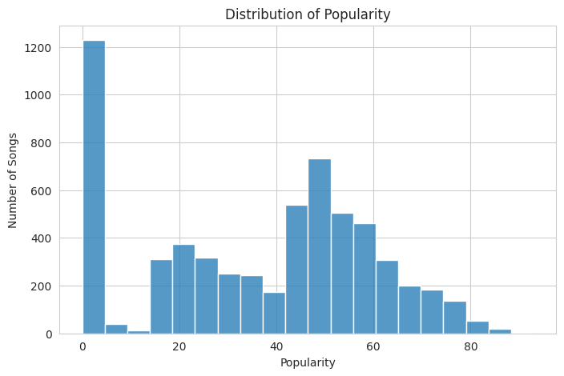
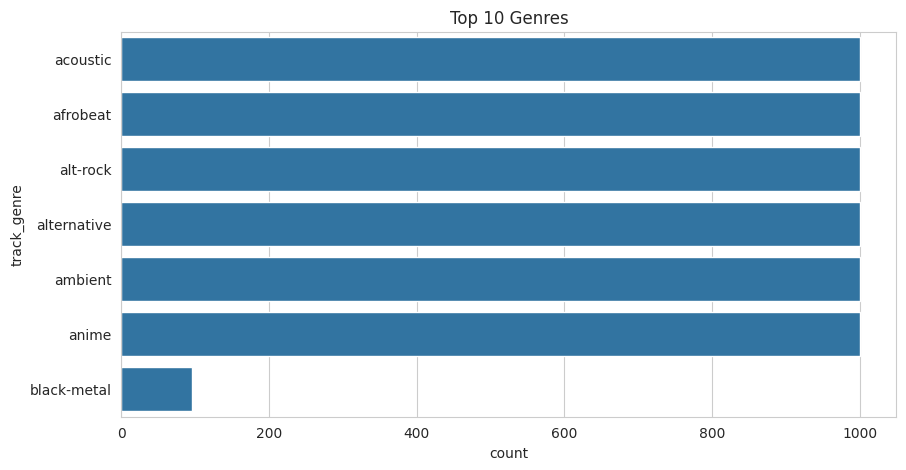
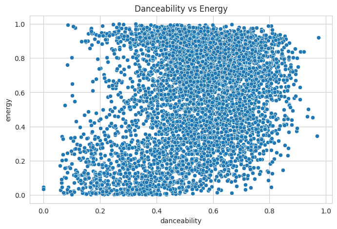
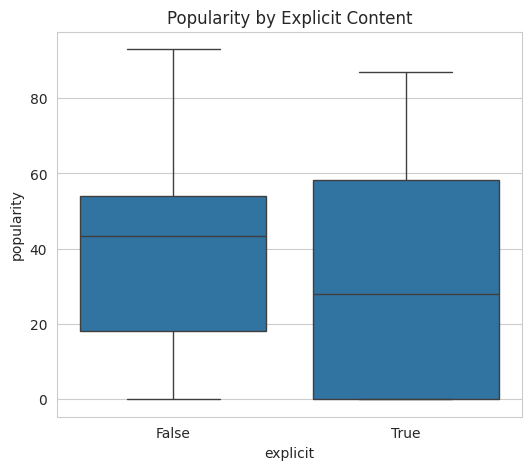
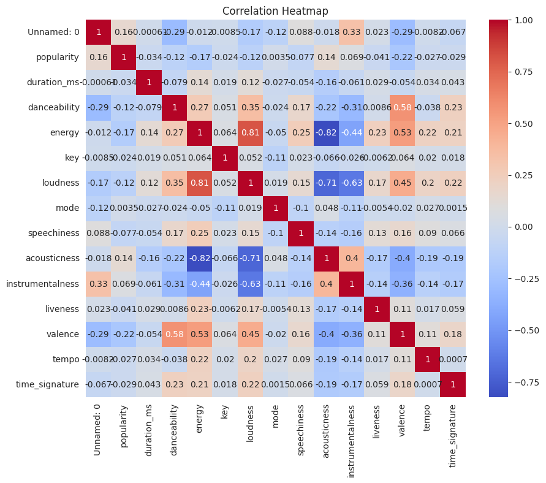
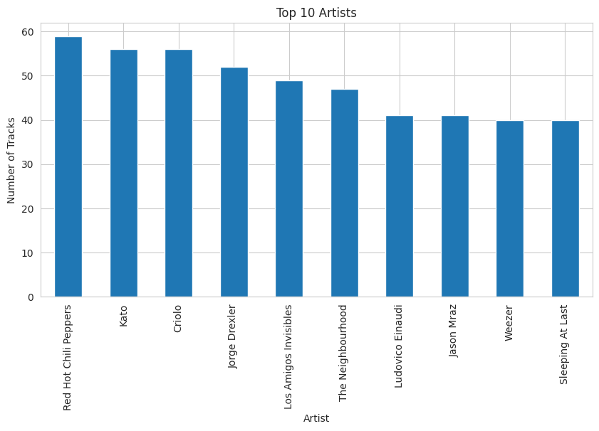

# Spotify Tracks Dataset - Exploratory Data Analysis

## Dataset Overview

- Dataset: Spotify Tracks Dataset
- Purpose: Perform Exploratory Data Analysis (EDA) and create visualizations.

## Visualizations

### 1. Distribution of Popularity

**Insight:** Most songs have low to medium popularity.

### 2. Top 10 Genres

**Insight:** Some genres contain significantly more tracks than others.

### 3. Danceability vs Energy

**Insight:** Songs with higher danceability generally have moderate to high energy.

### 4. Popularity by Explicit Content

**Insight:** Explicit songs are not consistently more popular.

### 5. Correlation Heatmap

**Insight:** Most numerical features have weak to moderate correlations.

### 6. Top 10 Artists

**Insight:** A few artists contribute a large number of tracks.

## Conclusion

The Spotify dataset provides insights into song characteristics, popularity, genres, and artists. Visualizations reveal important trends that are difficult to notice from raw data alone.
